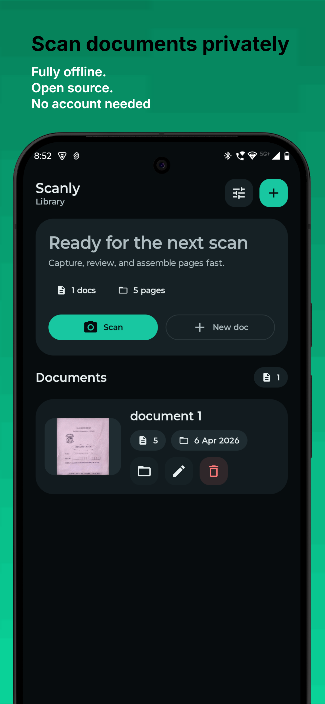
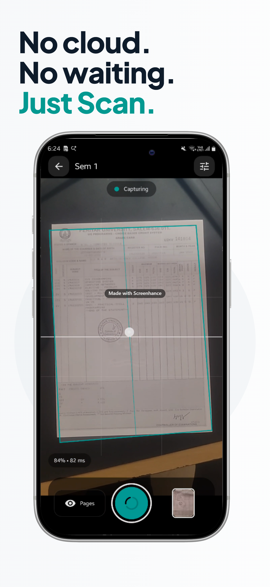
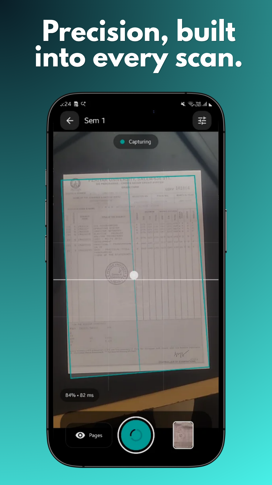
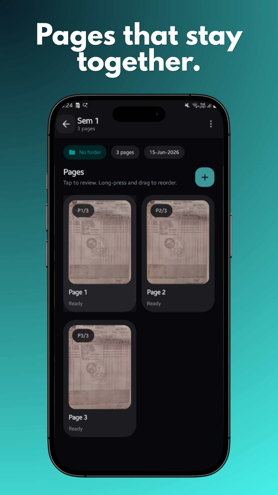
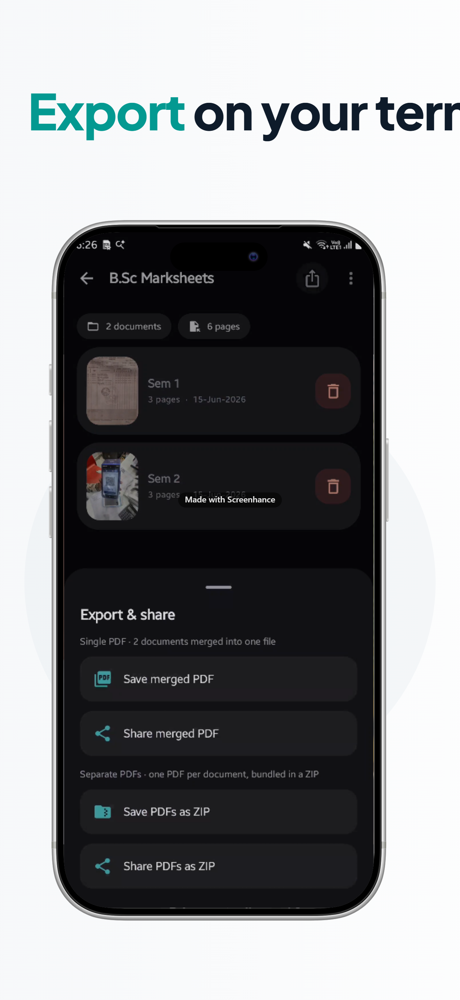
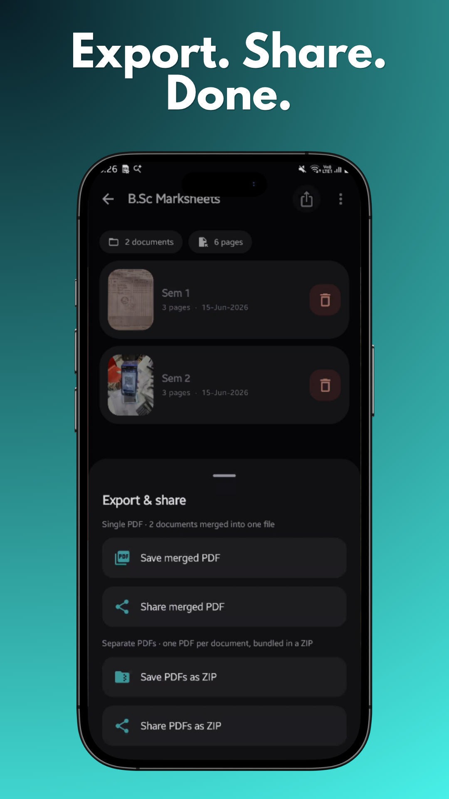

# Scanly

<p align="center">
  
</p>

Scanly is an offline-first Android document scanner built with Kotlin, Jetpack Compose, and Material 3.

It is designed for a practical, local-only scanning workflow:

1. capture a document with the camera or import images from the gallery
2. detect and correct page geometry
3. refine pages with editing tools
4. store and organize multi-page documents locally, including collections
5. export as PDF or image sets

## Highlights

- offline-first by default
- document library with searchable collections (groups) and recent-item home dashboard
- manual camera capture with live document guidance
- import images from the gallery to create or extend documents
- page crop, rotate, and filter editing
- PDF export and image archive export/share flows, including group-level export
- settings with theme mode, storage usage, clear-all-data, FAQs, and license info

**Current version:** `1.0.4` (version code `4`) — see [VERSION.md](VERSION.md) and [CHANGELOG.md](CHANGELOG.md).

## Screenshots

<table>
  <tr>
	<td></td>
	<td></td>
	<td></td>
  </tr>
  <tr>
	<td></td>
	<td></td>
	<td></td>
	<td></td>
  </tr>
</table>

## Tech Stack

- Kotlin
- Jetpack Compose + Material 3
- Hilt
- Navigation Compose
- CameraX
- Room
- DataStore
- LiteRT
- OpenCV
- Coroutines and Flow

## Project Structure

- `app/` – Android application source and module build files
- `docs/` – architecture notes, sprint archives, and release-readiness documentation
- `gradle/` – wrapper and version catalog configuration
- `implementation.md` – architecture snapshot and current implementation notes

## Current Architecture

The repository is organized as a production-style single-module app:

- `:app` is the only Android module
- entry point: `app/src/main/java/in/c1ph3rj/scanly/MainActivity.kt`
- app wiring: `ScanlyApplication`, navigation, Hilt modules, feature screens, and domain/data layers live under `app/src/main/java/in/c1ph3rj/scanly/`
- local data: Room, DataStore, and app-private file storage
- camera and processing stack: CameraX, LiteRT, and OpenCV-based page processing

## Build and Run

From the repository root on Windows:

```powershell
./gradlew.bat assembleDebug
./gradlew.bat testDebugUnitTest
```

For an additional verification pass:

```powershell
./gradlew.bat lintDebug
```

## Open Source Notes

- historical sprint notes live under `docs/sprint-*` and should be treated as archive material
- public collaboration guidance lives in `CONTRIBUTING.md`
- security reporting guidance lives in `SECURITY.md`
- release follow-up tasks are tracked in `OPEN_SOURCE_NEXT_STEPS.md`

## Documentation

- `LICENSE` – GNU AGPL-3.0-only license for this repository
- `VERSION.md` – current release version, version-code policy, and upgrade notes
- `CHANGELOG.md` – release notes for each published version
- `implementation.md` – current architecture snapshot and technical direction
- `OPEN_SOURCE_NEXT_STEPS.md` – checklist for publishing and maintaining the repo
- `SECURITY.md` – vulnerability reporting and disclosure guidance
- `CONTRIBUTING.md` – contribution workflow and expectations

## License

Scanly source code in this repository is licensed under `AGPL-3.0-only`.

Third-party dependencies and model assets can have their own license terms. Review
`app/src/main/assets/settings/licenses.json` and upstream sources before redistribution.

## Project Principles

- offline-first by default
- preserve raw captures and avoid destructive edits
- keep manual controls available even when automation is imperfect
- prefer small, testable domain and data boundaries

## Contributing

Before sending changes, run the Gradle checks above and keep new code aligned with the existing package structure under `in.c1ph3rj.scanly`.

If you are planning a change that affects public behavior, update the relevant docs in the root of the repository before or alongside the code change.

